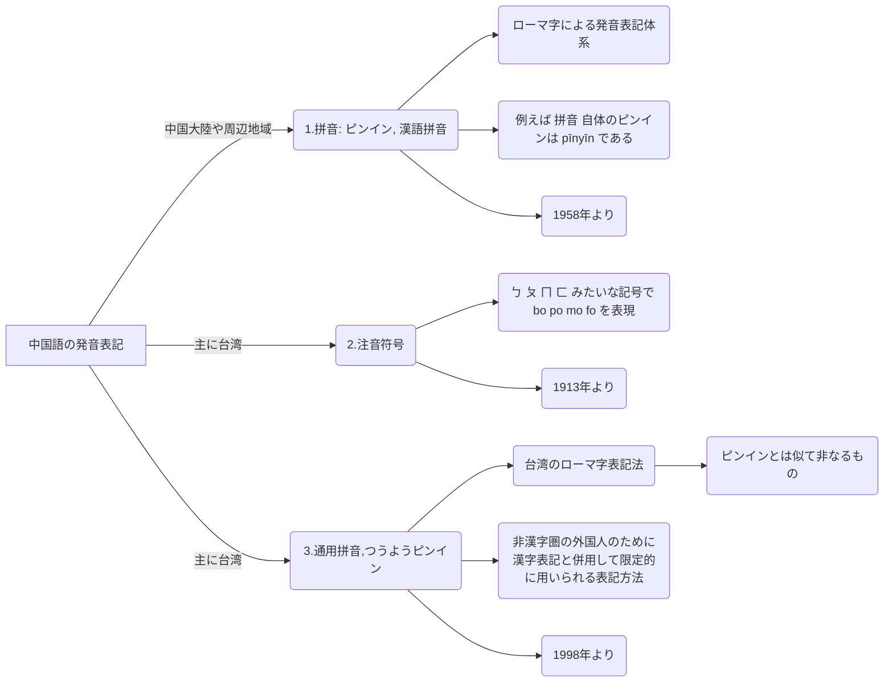
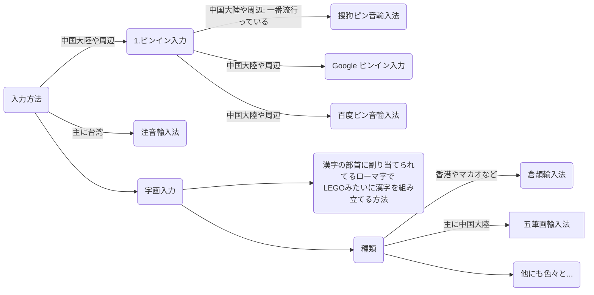

## 中国語の発音表記の種類

<Badge text="結論" vertical="middle" />

- **中国大陸に行くならピンイン**。無論、大陸のほとんどの人は `注音符号` と `通用拼音` を知らない。 🥲
- **台湾に行くなら注音符号**だけ覚えれば良い。無論、台湾のほとんどの人は `ピンイン` を知らない。 🥲

## 中国語入力方法(IME)

<Badge text="結論" vertical="middle" />

- **中国大陸に行くならピンインによる入力方法**を覚えれば良い。
  - 昔は字画入力による入力方法が一時はやっていたが、今はピンイン入力がだいぶ進化してきたため若い世代は基本ピンイン入力。
  - ピンイン入力の流行は、以下のようなことが要因になっているかなと。
    - 新たに覚えるものがない
    - 今時のビッグデータや AI のおかげで候補を素早く表示してくれたり
- **台湾に行くなら注音符号** になるかも（台湾の方に聞いたほうが良いかも 🥲）。

## 参考

[ピンインの WIKI](https://ja.wikipedia.org/wiki/拼音)

[注音符号の WIKI](https://ja.wikipedia.org/wiki/注音符号)

[通用拼音の WIKI](https://ja.wikipedia.org/wiki/通用拼音)

[中国語入力方法](https://www.wikiwand.com/ja/中国語入力方法#/google_vignette)
